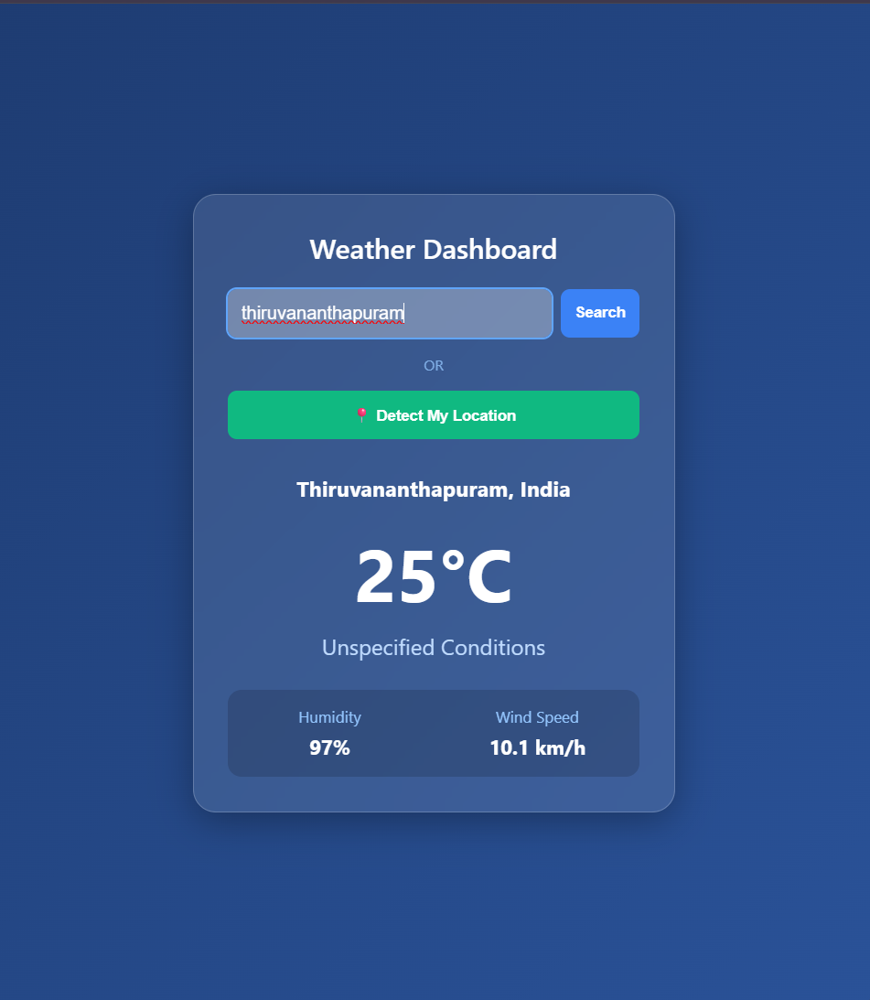

#  Minimalist Weather Dashboard

A lightweight, interactive web application that fetches and displays real-time weather data. Users can look up conditions for any city worldwide or utilize their browser's live GPS coordinates.


Built using **HTML5, CSS3, and Vanilla JavaScript**—powered by the open-source **Open-Meteo API** (no API keys required!).

##  Features

*  **Global City Search:** Converts any city name into precise map coordinates to fetch exact weather data.
*  **Live Geolocation:** Instantly pulls local weather using your browser's native location services.
*  **Essential Metrics:** Displays temperature, real-time weather conditions, relative humidity, and wind speed.
*  **Modern UI:** Features a responsive, glassmorphism-styled dashboard that adapts seamlessly to desktop and mobile screens.
*  **Simplistic:** Simple  to use and resposive design

##  Project Structure

```text
├── index.html   # Main page layout and structural components
├── style.css    # Modern UI themes and glassmorphism layouts
└── script.js    # API integrations, data handling, and app logic

